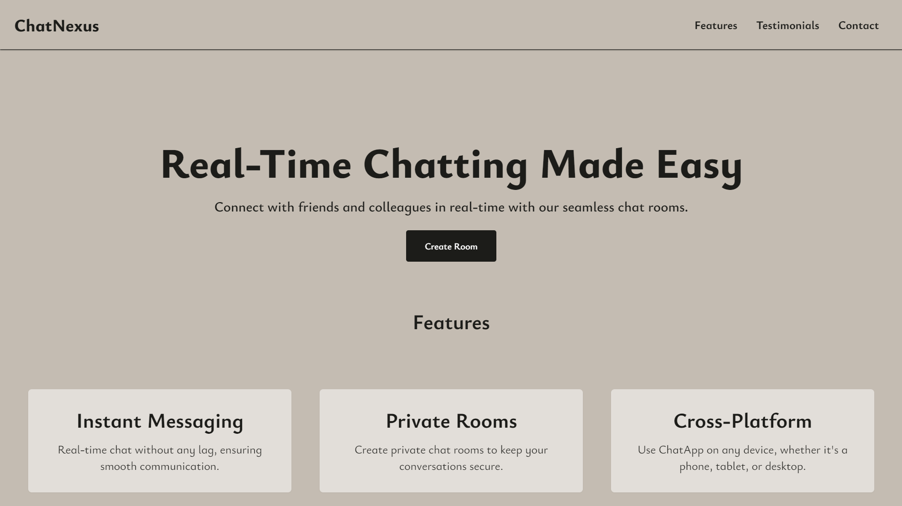
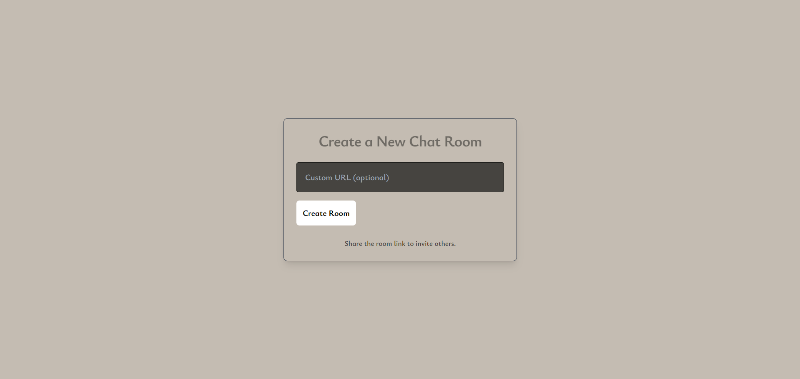
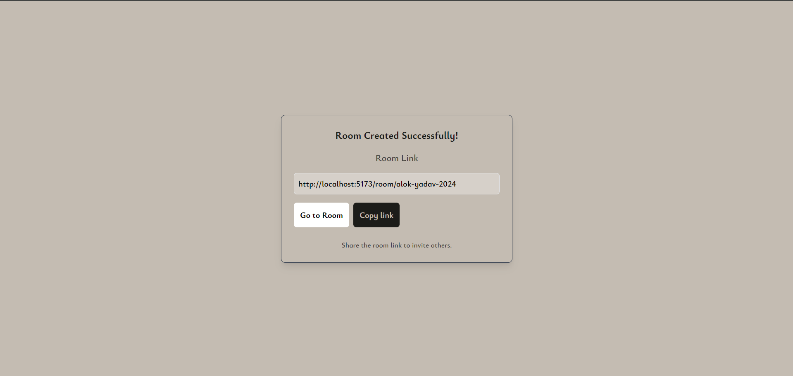
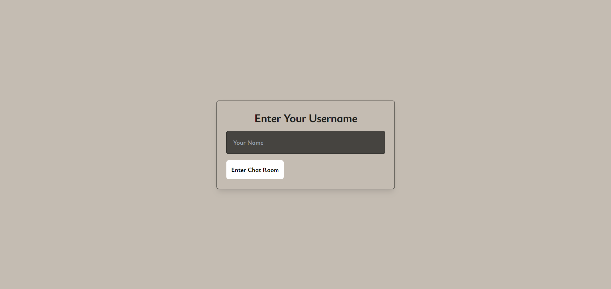
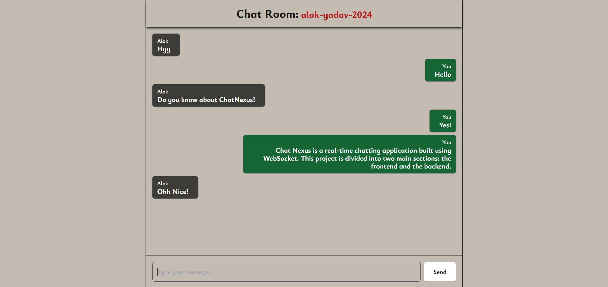

# Chat Nexus

**Chat Nexus** is a real-time chatting application built using WebSocket. This project is divided into two main sections: the frontend and the backend. The frontend provides a user-friendly interface for creating chat rooms and sending messages, while the backend handles the real-time communication between multiple users.

## Tech Stack

-   **Frontend**: React Js, Vite, Tailwind CSS
-   **Backend**: Node Js, Express Js, TypeScript, WebSocket
-   **Database**: MongoDB

## Features

-   Create chat rooms with unique links.
-   Custom username support.
-   Real-time communication using WebSocket.
-   Responsive UI with testimonials, headers, and contact sections.
-   Dynamic room creation and user management.

## Project Structure

The project is divided into two main folders:

1. `frontend`: Contains the React-based user interface.
2. `backend`: Handles the server logic and WebSocket communication.

And a `Readme.md` for guidance.

## ⚡ Getting Started

### Prerequisites

-   Node.js
-   npm / yarn

### 1. Clone the Repository

```bash
git clone https://github.com/alok-x0s1/Learning-ws.git
cd Learning-ws
```

### 2. Backend Setup

1. Navigate to the `backend` folder:
    ```bash
    cd backend
    ```
2. Install dependencies:
    ```bash
    npm install
    ```
3. Create a `.env` file in the `backend` directory and add the following environment variables:
    ```
    PORT=8000
    DB_URL=<YOUR_MONGODB_CONNECTION_STRING>
    FRONTEND_URL=http://localhost:5173
    ```
4. Configure `package.json` scripts to build and run the backend:
    ```json
    "scripts": {
      "build": "tsc -b",
      "dev": "node dist/index.js"
    }
    ```
5. Start the backend server:
    ```bash
    npm run build
    npm run dev
    ```

### 3. Frontend Setup

1. Navigate to the `frontend` folder:
    ```bash
    cd ../frontend
    ```
2. Install dependencies:
    ```bash
    npm install
    ```
3. Create a `.env` file in the `frontend` directory and add the following environment variables:
    ```
    VITE_BACKEND_URL=http://localhost:8000
    VITE_BACKEND_WS_URL=ws://localhost:8000
    VITE_FRONTEND_URL=http://localhost:5173
    ```
4. Start the frontend server:
    ```bash
    npm run dev
    ```

### 4. Running the Application

1. Open your browser and go to `http://localhost:5173`
2. You will see a homepage with the following sections -

    - **Header and Footer**: Navigation and contact details.
    - **Featured**: Special highlights and features of Chat Nexus.
    - **Testimonials**: User feedback and app highlights.
    - **Contact Section**: Ways to reach out.



1. Click on **"Create Room"** to create a room for chatting.
    - Then you will be directed to this page to create a room.
    - You can either give a unique name for chat room or click on create room, a unique id will be generated if you don't give any custom URL.



-   Provide a **custom name** (optional) and copy the generated room link.



-   Share the link with others or enter the room to start chatting in real time.
-   After Click on `Go to room` You have to enter you name. Then click on `Enter Chat Room`



-   Then the final chat room look like this 👇



## 📁 Folder Structure

```
chat-nexus/
│
├── backend/
│   ├── dist/          # Compiled JS files
│   ├── src/           # TypeScript source code
│   ├── package.json   # Backend dependencies and scripts
│   └── README.md      # Backend documentation
│
├── frontend/
│   ├── public/        # Public assets
│   ├── src/           # React components and pages
│   ├── package.json   # Frontend dependencies and scripts
│   └── README.md      # Frontend documentation
│
└── README.md          # Project-level documentation
```
